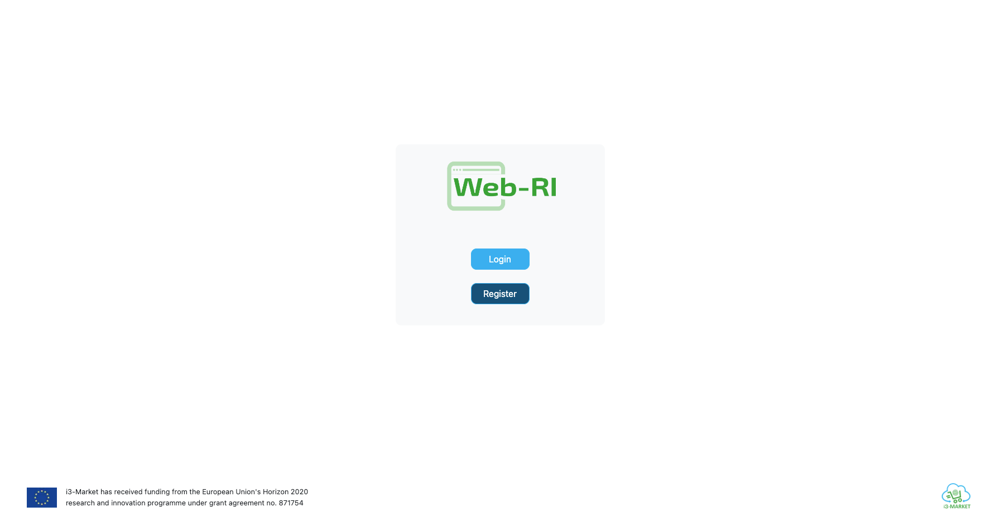
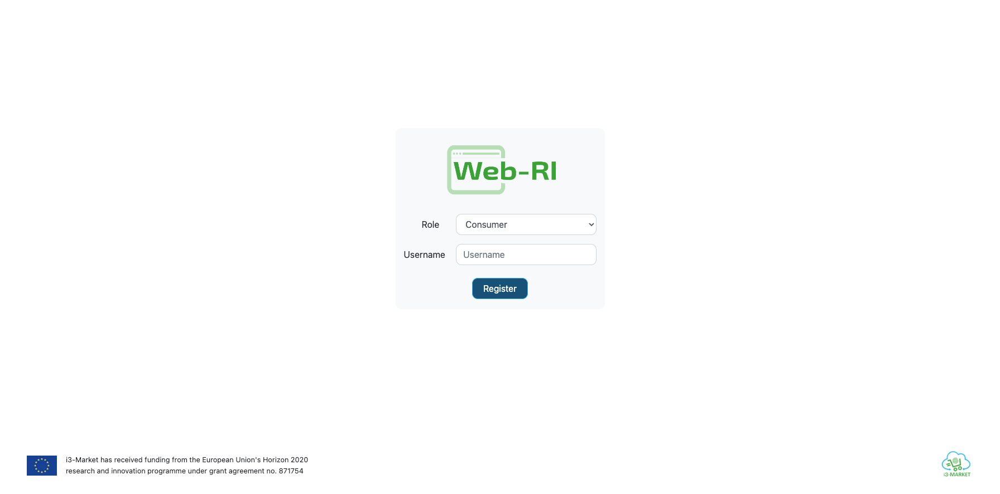
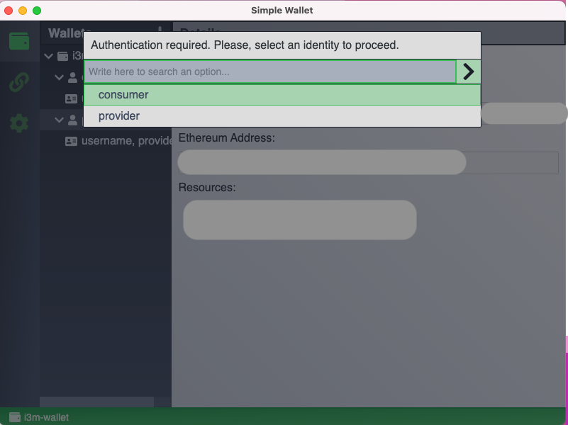
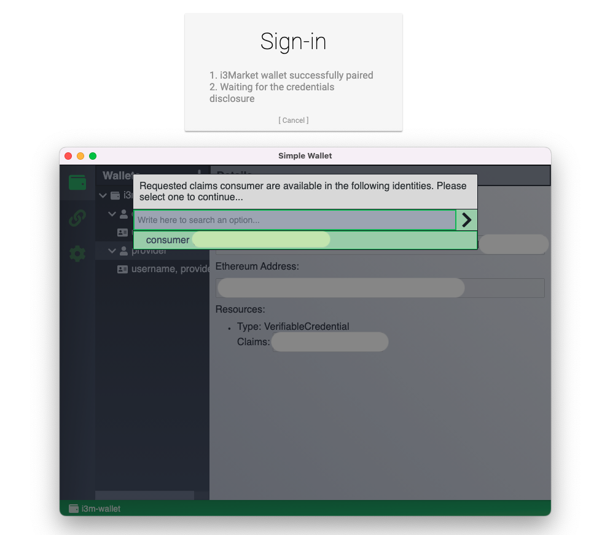
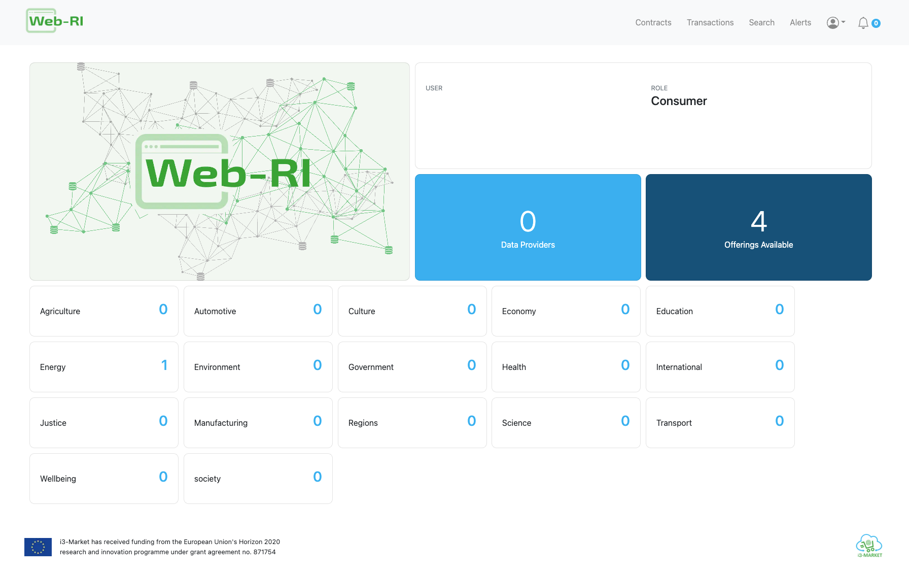

# WEB-RI
This repository is for the Web-RI project.

The Web-RI is a web interface that allows the users to interact with the functionalities provided by the SDK-RI. It can be reused and customized as part of each pilot specification and implementation needs.

This is a [Next.js](https://nextjs.org/) project bootstrapped with [`create-next-app`](https://github.com/vercel/next.js/tree/canary/packages/create-next-app).

## Getting Started
This project is divided into different directories:
- components: contains all visual elements that can be reused in all pages.
- lib: contains information such forms, colors, user and server configuration.
- pages: each file represents a React component with associated route based on its file name.
- public: contains files such images and logos.
- styles: responsible to customize the design of the website.

## Pre-Requisites
To perform the authentication, the i3M Wallet software must be installed and running on the user's computer. Also, must be created at least one wallet entry in the app, and for wallet entry must create at least one identity as well.

You can access [here](https://i3-market.gitlab.io/code/backplane/backplane-api-gateway/backplane-api-specification/systems/trust-security-privacy/smart-wallet/wallet-desktop.html) to get instructions to how to use it.


## Installation
```javascript
npm install
```

## Run
```javascript
[SDK_RI_ENDPOINT] [MONGO_URL] [OIDC_URL] [VC_URL] [MARKET_NAME] npm run dev -- -p [PORT]

// SDK_RI_ENDPOINT: sdk-ri endpoint (e.g. http://12.345.6.789:1234)
// MONGO_URL: mongodb local instance (e.g. mongodb://localhost:port)
// OIDC_URL: oidc provider (e.g. https://identity1.i3-market.eu/release2)
// VC_URL: verifiable credential service (e.g. https://identity1.i3-market.eu/release2/vc)
// MARKET_NAME: market ID of the notification service
// PORT: default running port (default=3000)
```
Note: Web-RI instance must run in same port as the registered OIDC client.

Web-RI can be accessible from localhost:3000:


### Register a verifiable credential in the Wallet
When choosing the "Register" button in authentication page, you will be redirected to the Register page where you can register a new verifiable credential in the wallet. For that, you must choose the role and set the desired username:


Then, Web-RI will call the Wallet to add the new verifiable credential:

Note: you need at least one identity created in the wallet.

If the information was successfully created, you will be redirected to the Login page.


### Login with the Wallet
When choosing the "Login" button in authentication page, you can log in using a verifiable credential from the wallet. For that, you must choose the role and then Web-RI will call the Wallet to sign with the desired role:


After successful login, you will be redirected to the Web-RI homepage:


## Run in Docker
To run WEB-RI as docker, first you must define the following environment variables in docker-compose.yml file:
````yaml
environment: 
  SDK_RI_ENDPOINT: sdk-ri endpoint
  MONGO_URL: mongodb url 
  OIDC_URL: oidc provider
  VC_URL: verifiable credential service
  MARKET_NAME: market of notification service

  MONGO_INITDB_ROOT_USERNAME: mongodb username
  MONGO_INITDB_ROOT_PASSWORD: mongodb password
````
Then,
```javascript
docker-compose up
```
